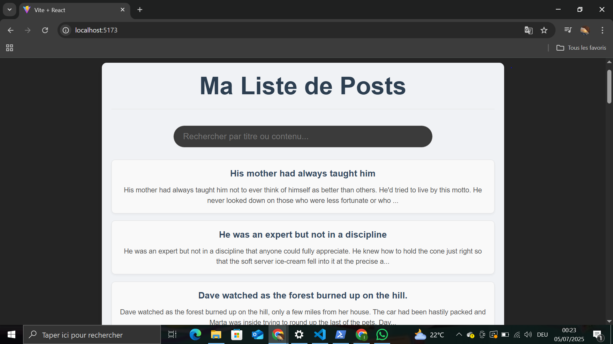

# React + Vite

This template provides a minimal setup to get React working in Vite with HMR and some ESLint rules.

Currently, two official plugins are available:

- [@vitejs/plugin-react](https://github.com/vitejs/vite-plugin-react/blob/main/packages/plugin-react) uses [Babel](https://babeljs.io/) for Fast Refresh
- [@vitejs/plugin-react-swc](https://github.com/vitejs/vite-plugin-react/blob/main/packages/plugin-react-swc) uses [SWC](https://swc.rs/) for Fast Refresh

## Expanding the ESLint configuration

If you are developing a production application, we recommend using TypeScript with type-aware lint rules enabled. Check out the [TS template](https://github.com/vitejs/vite/tree/main/packages/create-vite/template-react-ts) for information on how to integrate TypeScript and [`typescript-eslint`](https://typescript-eslint.io) in your project.

---

## Exercice 1 : État et Effets

### 1.1 Compléter le hook `usePosts` pour récupérer les posts depuis l'API dummyjson.com

**Explication de la solution :**
J'ai créé un hook personnalisé `usePosts` dans `src/hooks/usePosts.js`. Ce hook utilise `useState` pour gérer trois états : `posts` (la liste des articles), `isLoading` (pour savoir si les données sont en cours de chargement) et `error` (pour capturer les éventuelles erreurs).
Le hook utilise `useEffect` pour déclencher la récupération des données via `fetch` depuis l'API `https://dummyjson.com/posts` une seule fois au montage du composant. Un bloc `try-catch-finally` assure la gestion des succès, des erreurs réseau/parsing et la mise à jour correcte de l'état `isLoading`.

**Captures d'écran montrant le fonctionnement :**
*(Pour cette étape, tu ne verras pas directement le fonctionnement dans l'interface, car le hook ne fait que récupérer les données. Tu pourrais prendre une capture d'écran de la console du navigateur (touche F12, onglet "Console" et "Network") pour montrer que la requête est partie et a reçu une réponse 200, ou que l'erreur s'affiche si tu déconnectes ton internet par exemple.)*

**Difficultés rencontrées et comment vous les avez résolues :**
* **Gestion des états de chargement et d'erreur :** Au début, je n'avais que l'état `posts`. J'ai ajouté `isLoading` et `error` pour fournir un retour utilisateur clair. `isLoading` est mis à `true` avant la requête et à `false` dans le bloc `finally`. `error` est mis à jour dans le bloc `catch`.
* **Parsing de la réponse de l'API :** L'API `dummyjson.com/posts` renvoie un objet JSON avec une propriété `posts` qui contient le tableau d'articles. J'ai donc dû accéder à `data.posts` après avoir parsé la réponse (`response.json()`).

### 1.2 Implémenter le composant `PostList` pour afficher les posts

**Explication de la solution :**
Le composant `PostList` (situé dans `src/components/PostList.jsx`) reçoit les props `posts`, `isLoading`, et `error` de son parent (ici, `App.jsx`). Il gère l'affichage conditionnel : un message de chargement si `isLoading` est vrai, un message d'erreur si `error` est présent, un message "Aucun post trouvé" si la liste est vide, et enfin la liste des posts si tout est normal. Chaque post est affiché avec son titre et un extrait de son contenu, en utilisant `post.id` comme clé unique pour chaque élément.
Le composant `App.jsx` a été modifié pour importer et utiliser le hook `usePosts` et le composant `PostList`, en passant les états récupérés.

**Captures d'écran montrant le fonctionnement :**

**1. Affichage initial de la liste des posts (avec le message de chargement si visible, puis la liste complète) :**

**2. (Optionnel) Message d'erreur si la connexion est coupée :**

**Difficultés rencontrées et comment vous les avez résolues :**
* **Passer les props correctement :** Il était crucial de s'assurer que les trois états (`posts`, `isLoading`, `error`) du hook `usePosts` soient bien passés en tant que props au composant `PostList` depuis `App.jsx`.
* **Gestion des clés pour les listes :** J'ai utilisé `key={post.id}` lors du `map` pour que React puisse identifier de manière unique chaque élément de la liste, ce qui est une bonne pratique pour la performance et la stabilité.
* **Affichage d'extrait de texte :** Pour ne pas afficher des paragraphes trop longs, j'ai utilisé `post.body.substring(0, 150) + '...'` pour tronquer le contenu.

### 1.3 Ajouter la fonctionnalité de recherche par titre ou contenu dans `PostSearch`

**Explication de la solution :**
J'ai créé le composant `PostSearch` dans `src/components/PostSearch.jsx`. Ce composant contient un `input` et gère son propre état local (`searchTerm`) pour le texte saisi. Il reçoit une prop `onSearch` (une fonction de rappel) du composant parent. À chaque modification du champ de saisie, `handleChange` met à jour `searchTerm` et appelle `onSearch` avec la nouvelle valeur.

Dans `App.jsx`, j'ai ajouté un nouvel état `filteredPosts` qui sera la liste réellement affichée. Initialement, `filteredPosts` est mis à jour avec tous les `posts` récupérés par `usePosts` via un `useEffect`. La fonction `handleSearch` est passée à `PostSearch` via la prop `onSearch`. Cette fonction filtre les `posts` originaux en vérifiant si le `title` ou le `body` (convertis en minuscules pour une recherche insensible à la casse) incluent le `searchTerm`. Si le `searchTerm` est vide, `filteredPosts` est réinitialisé à la liste complète des `posts`.

**Captures d'écran montrant le fonctionnement :**

**. La page après avoir tapé un mot  dans la barre de recherche, montrant les posts filtrés :**

**Difficultés rencontrées et comment vous les avez résolues :**
* **Flux de données entre parent et enfant :** La principale difficulté était de faire passer le terme de recherche du composant `PostSearch` (enfant) au composant `App` (parent) pour que ce dernier puisse filtrer la liste. J'ai résolu cela en utilisant le "lifting state up" : une fonction `onSearch` est définie dans `App.jsx` et passée comme prop à `PostSearch`. `PostSearch` l'appelle quand la valeur de l'input change.
* **Logique de filtrage insensible à la casse :** J'ai converti à la fois le `searchTerm` et le `title`/`body` des posts en minuscules (`.toLowerCase()`) avant d'utiliser `includes()` pour assurer que la recherche fonctionne indépendamment de la casse.
* **Réinitialisation de la liste :** J'ai ajouté une condition pour que si `searchTerm` est vide, la liste revienne à afficher tous les posts initiaux, plutôt que de rester filtrée ou vide.

